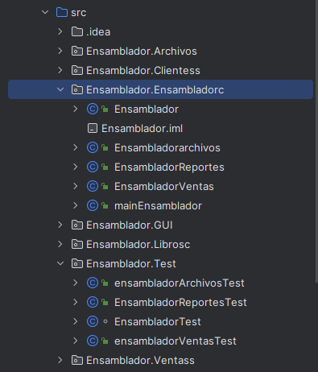
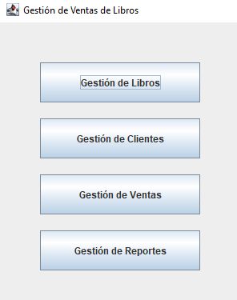
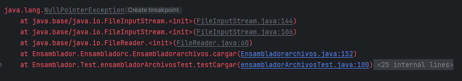

# Proyecto Librería 📖

El objetivo de este proyecto es desarrollar un sistema de gestión de una tienda de libros en Java que incluya funcionalidades de manejo de inventario, gestión de clientes, ventas, interfaz gráfica de usuario (GUI) y persistencia de datos en archivos.

## Estructura del proyecto ⚙️
> [!NOTE]

<br/>
> Esta estructura esta sujeta a cambios
<br/>

## Ejecutando las pruebas 🧪

Este es un ejemplo de un método de prueba realizado,<b> testEliminarLibro() </b>, prueba la funcionalidad de eliminar un libro de la lista de libros en un objeto Ensamblador. Aquí está lo que hace:

<b>Configuración del escenario:</b> Crea dos objetos de libro (libro1 y libro2) con datos predefinidos. Luego, inicializa un objeto Ensamblador con una lista de libros que contiene estos dos libros.

<b>Caso de prueba:</b> Eliminar un libro existente: Elimina libro1 de la lista de libros usando el método eliminarLibro().

<b>Verificación del resultado:</b> Se asegura de que libro1 se haya eliminado correctamente de la lista y de que libro2 permanezca en la lista.

<b>Caso de prueba:</b> Eliminar un libro que no existe: Intenta eliminar un libro que no está en la lista.

<b>Verificación del resultado:</b> Comprueba que la lista de libros permanezca sin cambios después de intentar eliminar un libro que no está en ella.

Esta prueba asegura que el método eliminarLibro() funcione correctamente tanto para libros existentes como para libros que no existen en la lista. Esto garantiza un comportamiento adecuado en el manejo de la lista de libros en el objeto Ensamblador.

```java
  @Test
    public void testEliminarLibro() {
        // Configure scenario: create objects with data
        String tituloLibro1 = "Clean Code";
        String autorLibro1 = "Robert C. Martin";
        String generoLibro1 = "Programming";
        double precioLibro1 = 35.99;

        String tituloLibro2 = "The Pragmatic Programmer";
        String autorLibro2 = "Andrew Hunt & David Thomas";
        String generoLibro2 = "Software Development";
        double precioLibro2 = 42.50;

        Libros libro1 = new Libros(tituloLibro1, autorLibro1, generoLibro1, precioLibro1);
        Libros libro2 = new Libros(tituloLibro2, autorLibro2, generoLibro2, precioLibro2);

        List<Cliente> clientes = new ArrayList<>();
        List<Archivos> archivos = new ArrayList<>();
        List<Ventas> ventas = new ArrayList<>();

        Ensamblador ensamblador = new Ensamblador(clientes, new ArrayList<>() {{
            add(libro1);
            add(libro2);
        }}, archivos, ventas); // Initialize libros list

        // Test case: Remove existing book
        ensamblador.eliminarLibro(libro1);

        // Verify result: libro1 is removed
        assertEquals(1, ensamblador.getLibros().size());
        assertFalse(ensamblador.getLibros().contains(libro1));
        assertTrue(ensamblador.getLibros().contains(libro2));

        // Test case: Remove non-existent book
        ensamblador.eliminarLibro(new Libros("Nuevo Libro", "Nuevo Autor", "Nuevo Género", 0.0));

        // Verify result: list remains unchanged
        assertEquals(1, ensamblador.getLibros().size());
        assertTrue(ensamblador.getLibros().contains(libro2));
    }
```
## Despliegue 📦

<p align="center">
  
</p>

## Complicaciones 🐛

## Objetivos 🎯

Integrar los diferentes módulos desarrollados por los otros equipos en una aplicación funcional y completa.

*	Crear la clase Ensamblador con métodos para integrar los diferentes elementos del sistema, como clientes, libros, archivos, etc.
*	Definir subclases específicas para manejar ventas, archivos y reportes, e implementa los métodos necesarios para cada una.

•	Atributos:
- [ ] clientes: Una lista de objetos Cliente.
- [ ]  libros: Una lista de objetos Libro.
- [ ]  archivos: Una lista de objetos Archivo.
*	Métodos:
- [ ]  agregarCliente(Cliente cliente): Agrega un cliente a la lista de clientes.
- [ ] eliminarCliente(Cliente cliente): Elimina un cliente de la lista.
- [ ] 	agregarLibro(Libro libro): Agrega un libro a la lista de libros.
- [ ] 	eliminarLibro(Libro libro): Elimina un libro de la lista.
- [ ] 	agregarArchivo(Archivo archivo): Agrega un archivo a la lista de archivos.
- [ ] 	eliminarArchivo(Archivo archivo): Elimina un archivo de la lista.
- [ ] buscarClientePorNombre(String nombre): Busca un cliente por su nombre y devuelve el objeto Cliente correspondiente.
- [ ] 	buscarLibroPorTitulo(String titulo): Busca un libro por su título y devuelve el objeto Libro correspondiente.
- [ ] 	guardarDatosEnArchivo(Archivo archivo): Guarda los datos de la tienda de libros en un archivo especificado.
- [ ] 	cargarDatosDesdeArchivo(Archivo archivo): Carga los datos de la tienda de libros desde un archivo especificado.
- [ ] 	generarInforme(): Genera un informe con estadísticas sobre la tienda de libros, como el número de clientes, libros disponibles, etc.
-------------------------------------------------------------------
* Subclase EnsambladorVentas:
Esta subclase de Ensamblador se especializa en el ensamblaje de las ventas de libros.
	Atributos adicionales:
- [ ] 	ventas: Una lista de objetos Venta.
	Métodos adicionales:
- [ ] 	agregarVenta(Venta venta): Agrega una venta a la lista de ventas.
- [ ] 	eliminarVenta(Venta venta): Elimina una venta de la lista.
- [ ] 	buscarVentaPorCliente(Cliente cliente): Busca todas las ventas asociadas a un cliente específico.
- [ ]	buscarVentaPorLibro(Libro libro): Busca todas las ventas asociadas a un libro específico.
- [ ]	calcularTotalVentas(): Calcula el total de ventas realizadas.
----------------------------------------------------------------------------------------------
* Subclase EnsambladorArchivos:
Esta subclase de Ensamblador se encarga de manejar los archivos en la tienda de libros.
•	Métodos adicionales:
- [ ]	guardarDatosEnArchivos(): Guarda todos los datos de la tienda de libros en archivos específicos.
- [ ] cargarDatosDesdeArchivos(): Carga todos los datos de la tienda de libros desde archivos específicos.
----------------------------------------------------------------------------------------------------------------------------------------------
* Subclase EnsambladorReportes:
Esta subclase de Ensamblador se dedica a generar reportes y estadísticas sobre la tienda de libros.
-	Métodos adicionales:
- [ ]	generarReporteClientes(): Genera un reporte con información detallada sobre los clientes.
- [ ]	generarReporteLibros(): Genera un reporte con información detallada sobre los libros disponibles.
- [ ] generarReporteVentas(): Genera un reporte con información detallada sobre las ventas realizadas.

## Construido con 🛠️
  <br/> &ensp; Java

## Autores ✒️

* **Guillermo Castro Abarca**
* **Geovana Da Silva Oliveira**
* **Luigi Alfonso Pineda**
* **Gianfranco**

 :+1: This PR looks great - it's ready to merge! :shipit:
